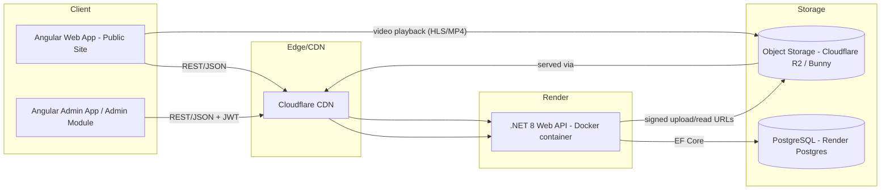
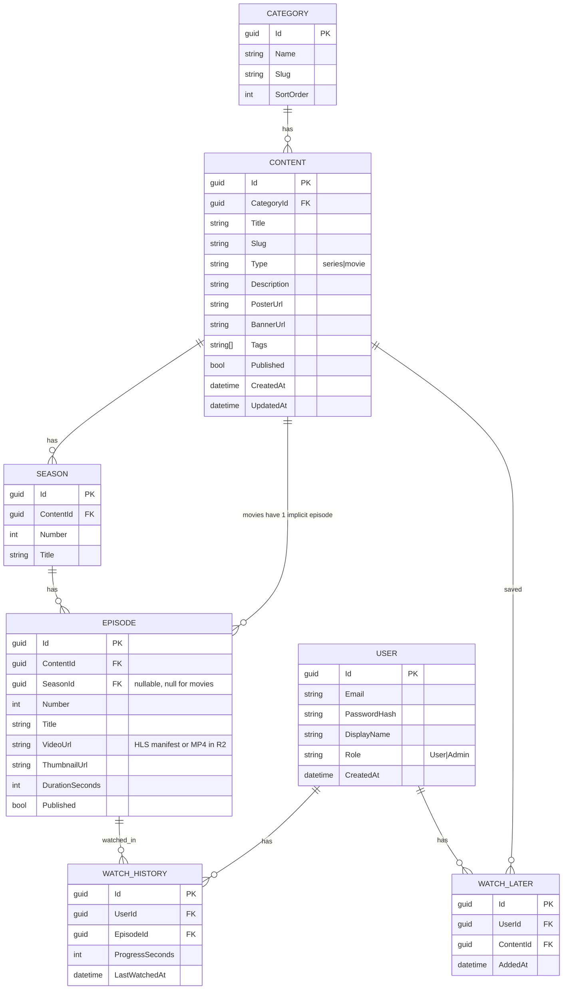

# AniSpeaker — Platform Rework Architecture

**Status:** Proposed
**Scope:** Backend migration (Cloudflare Worker + JSON DB → .NET API + PostgreSQL, Dockerized on Render), Admin CMS, Guest-first auth with optional login, Watch Later / Continue Watching.

---

## 1. Current State (as-is)

| Layer | Current |
|---|---|
| Frontend | Angular SPA (Home, Cartoons, Anime, Movies, Search) |
| Backend | Cloudflare Worker |
| Database | JSON file(s) on Cloudflare (KV / static JSON) |
| Auth | None |
| Video hosting | Unknown / external links (assumed) |
| Admin | None — content is edited by hand in JSON |

**Why this breaks down as you grow:**
- JSON-as-DB has no relational integrity, no indexing, no concurrent-write safety, and every content edit means redeploying/rewriting a file.
- No admin UI means you're hand-editing JSON to add a show — error-prone and slow.
- No user layer means no Watch Later / Continue Watching, which you now want.
- Cloudflare Workers are great for edge reads but awkward for a stateful CRUD-heavy admin backend — .NET on a normal container host is a better fit for what you're building next.

---

## 2. Goals of the Rework

1. Replace JSON DB with a real relational database.
2. New backend: **ASP.NET Core Web API**, containerized, hosted on **Render**.
3. **Admin panel** (separate route/app) with full CRUD: add/edit/delete Categories, Series, Seasons, Episodes/Movies, and **video upload**.
4. **No forced login** for viewers — browsing and watching work anonymously.
5. **Optional login** unlocks **Watch Later** and **Continue Watching / Recently Watched**.
6. Keep Angular frontend, but restructure it to be scalable (lazy-loaded feature modules, typed API layer, guest-identity handling).
7. Video files served efficiently (not through the API server itself) via CDN/object storage.

---

## 3. High-Level Architecture



**Key decision: the .NET API never streams video bytes itself.** It only issues metadata + signed URLs. Video files live in object storage and are streamed directly to the browser through a CDN. This keeps your Render container cheap and stateless.

---

## 4. Tech Stack

| Concern | Choice | Why |
|---|---|---|
| Backend framework | ASP.NET Core 8 Web API | Modern, fast, first-class Docker support, great EF Core tooling |
| ORM | Entity Framework Core | Migrations, LINQ, works cleanly with Postgres |
| Database | PostgreSQL (Render Postgres, managed) | Real relational DB replacing the JSON file — no Cloudflare DB involved at all; same host (Render) as the API for simplicity |
| Auth | ASP.NET Identity + JWT (access + refresh token) | Stateless, works well with SPA, supports optional/guest flow |
| Video/image storage | Cloudflare R2 (you already use Cloudflare) or Bunny Storage | S3-compatible, cheap egress (R2 has **zero egress fees**, which matters a lot for video) |
| Video delivery | Cloudflare CDN in front of R2; HLS (`.m3u8` + `.ts`) for adaptive playback | Avoids re-buffering on slow connections, standard for OTT |
| Containerization | Docker (multi-stage build) | Required for Render deployment |
| Hosting (API) | Render (Web Service, Docker) | You already picked this |
| Hosting (DB) | Render Postgres | Managed, automatic backups, same dashboard/billing as the API — no separate DB vendor |
| Frontend | Angular (existing), standalone components + lazy routes | Keep your investment, just restructure |
| Admin auth | Same JWT system, `Admin` role claim | One backend, role-gated endpoints |

> If budget is a real constraint: Render free/starter web service + Render's cheapest Postgres tier + Cloudflare R2 (10GB free, no egress fee) is essentially a low-cost stack to start, with everything except object storage sitting on a single host (Render).

---

## 5. Database Schema



**Notes:**
- `Content.Type` distinguishes Series vs Movie so movies just get a single implicit Episode row (keeps playback logic uniform — everything plays through `Episode.VideoUrl`).
- `WatchHistory` is upserted (unique index on `UserId + EpisodeId`) so "Continue Watching" is just: latest `LastWatchedAt`, `ProgressSeconds < DurationSeconds * 0.95`.
- Guests (not logged in) never write to `WatchHistory`/`WatchLater` server-side. Optionally cache their last few views in `localStorage` client-side so "Recently Watched" still shows *something* without an account (see §8).

---

## 6. Backend (.NET) Architecture

Use a pragmatic **3-layer Clean Architecture** (don't over-engineer this for a catalog app):

```
AniSpeaker.Api/                 (composition root — Program.cs, controllers, DI, middleware)
├── Controllers/
│   ├── ContentController.cs      # public: browse/search
│   ├── PlaybackController.cs     # public: get video URL for an episode
│   ├── AuthController.cs         # register/login/refresh
│   ├── AccountController.cs      # watch-later, watch-history (auth required)
│   └── Admin/
│       ├── AdminContentController.cs   # CRUD content/seasons/episodes
│       ├── AdminCategoryController.cs
│       └── AdminUploadController.cs    # request pre-signed upload URL
├── Program.cs
└── Dockerfile

AniSpeaker.Application/          (business logic, DTOs, interfaces)
├── Content/
├── Watch/
├── Auth/
└── Common/ (pagination, result wrappers)

AniSpeaker.Infrastructure/       (EF Core, R2/S3 client, Identity)
├── Persistence/
│   ├── AppDbContext.cs
│   ├── Migrations/
│   └── Repositories/
├── Storage/
│   └── R2StorageService.cs       # generates pre-signed PUT/GET URLs
└── Identity/

AniSpeaker.Domain/                (entities only, no dependencies)
```

### Video upload flow (important — don't proxy big files through your API)
1. Admin picks a file in the admin UI.
2. Admin UI calls `POST /api/admin/uploads/init` → API returns a **pre-signed R2 PUT URL** (valid ~15 min).
3. Browser uploads the file **directly to R2** using that URL (progress bar works natively via `XMLHttpRequest`/`fetch` upload progress).
4. Browser calls `POST /api/admin/episodes` with the resulting object key/URL to save the Episode record.

This keeps large video uploads off your Render container entirely (Render has request size/time limits, and you don't want to pay for that bandwidth twice).

---

## 7. Video Storage & Streaming

| Option | Pros | Cons |
|---|---|---|
| **Cloudflare R2** (recommended) | Zero egress fees, S3-compatible SDK, you already use Cloudflare, pairs with Cloudflare CDN | You manage your own encoding (or skip HLS and serve MP4 directly, which is fine at moderate scale) |
| Cloudflare Stream | Built-in adaptive HLS transcoding, analytics, per-minute pricing | Costs scale with minutes stored/streamed — pricier at catalog size |
| Bunny Stream | Cheap, built-in HLS + CDN | Separate vendor from your existing Cloudflare setup |

**Recommendation:** Start with **R2 + plain MP4 files behind Cloudflare CDN** (simplest, works today, `<video>` tag handles it fine). If buffering on slow connections becomes a real problem, move to HLS (`ffmpeg` to produce `.m3u8` + segments on upload, still stored in R2) — this is an additive change later, not a rewrite.

---

## 8. Auth Strategy — Guest-First

**Requirement:** browsing/watching works with zero login. Login is optional and only unlocks personalization.

| Feature | Guest (no login) | Logged-in |
|---|---|---|
| Browse, search, watch | ✅ | ✅ |
| Watch Later | ❌ (or client-side only, see below) | ✅ synced to account |
| Continue Watching / Recently Watched | Client-side only (localStorage, last ~10 items, per-device) | ✅ synced to account, cross-device |

**How it works technically:**
- No forced auth middleware on `Content`/`Playback` controllers — fully anonymous.
- `AccountController` endpoints (`/api/account/watch-later`, `/api/account/history`) require a valid JWT — return `401` if missing, and the **frontend simply doesn't call them** when there's no logged-in user.
- On the client: maintain a lightweight `AuthService` with `isLoggedIn$` observable. When false, "Recently Watched" reads from `localStorage` (updated on every `timeupdate` player event, throttled); when true, it reads from `/api/account/history` instead. Same pattern for Watch Later, except with no logged-in fallback (just show a "Log in to save for later" prompt — small friction is fine for a save action, but never for playback).
- JWT: short-lived access token (15 min) + refresh token (7–30 days, httpOnly cookie) so users stay logged in without re-entering credentials constantly.

---

## 9. Admin Panel Spec

A separate route tree in the same Angular app (e.g. `/admin/**`), guarded by a route guard checking `role === 'Admin'`, calling admin-only endpoints.

**Pages:**

1. **Dashboard** — counts (Series, Movies, Episodes, Users), recent uploads.
2. **Categories** — table with inline add/edit/delete, drag-to-reorder (`SortOrder`).
3. **Content list** (Series & Movies) — searchable/filterable table, "+ New" button, edit/delete row actions, publish/unpublish toggle.
4. **Content editor** (add/edit) — form: Title, Slug (auto-generated, editable), Category, Type, Description, Poster/Banner image upload, Tags, Published toggle.
   - If `Type = Series`: nested **Seasons → Episodes** editor (add season, add episode under season, reorder, each episode has its own video upload + thumbnail + duration).
   - If `Type = Movie`: single video upload field directly on the content form (no seasons).
5. **Video upload widget** (shared component) — drag/drop or file picker → calls `init upload` → direct PUT to R2 with progress bar → on success, stores the returned URL into the form.
6. **Users** (optional, phase 2) — list registered users, promote/demote Admin role.

**Core admin endpoints:**

```
GET    /api/admin/categories
POST   /api/admin/categories
PUT    /api/admin/categories/{id}
DELETE /api/admin/categories/{id}

GET    /api/admin/content?search=&category=&type=&page=
POST   /api/admin/content
PUT    /api/admin/content/{id}
DELETE /api/admin/content/{id}

POST   /api/admin/content/{id}/seasons
POST   /api/admin/seasons/{id}/episodes
PUT    /api/admin/episodes/{id}
DELETE /api/admin/episodes/{id}

POST   /api/admin/uploads/init      { fileName, contentType, folder }  → { uploadUrl, publicUrl, objectKey }
```

**Public endpoints:**

```
GET  /api/content?category=&type=&page=          # browse
GET  /api/content/{slug}                          # detail + seasons/episodes
GET  /api/search?q=                                # typeahead + full results
GET  /api/playback/{episodeId}                     # returns signed/public video URL
POST /api/auth/register
POST /api/auth/login
POST /api/auth/refresh
GET  /api/account/history        (auth)
POST /api/account/history        (auth)  # upsert progress
GET  /api/account/watch-later    (auth)
POST /api/account/watch-later    (auth)
DELETE /api/account/watch-later/{contentId} (auth)
```

---

## 10. Frontend (Angular) Architecture

Restructure into feature-based, lazy-loaded modules (or standalone components with lazy routes if on Angular 17+):

```
src/app/
├── core/                     # singletons: interceptors, auth service, api base config
│   ├── interceptors/         # attach JWT, handle 401 refresh
│   └── services/
│       ├── auth.service.ts
│       ├── api.service.ts    # thin typed HTTP wrapper
│       └── local-history.service.ts   # guest-mode "recently watched" in localStorage
├── shared/                   # dumb/presentational components: card, carousel, button, modal
├── features/
│   ├── home/
│   ├── browse/                # category pages (Cartoons/Anime/Movies)
│   ├── search/
│   ├── content-detail/
│   ├── player/                 # video player page, reports progress
│   ├── watch-later/            (auth-gated)
│   ├── auth/                   # login/register (optional, non-blocking)
│   └── admin/                  # lazy-loaded, role-guarded
│       ├── dashboard/
│       ├── categories/
│       ├── content-list/
│       ├── content-editor/
│       └── uploads/
├── models/                   # DTO interfaces matching API contracts
└── app.routes.ts
```

**Key patterns:**
- Route-level lazy loading for `/admin` so its bundle never ships to normal viewers.
- `AuthInterceptor` attaches JWT if present; silently does nothing for guests (no forced redirect to login anywhere in the public site).
- `authGuard` only applied to `/admin/**` and `/watch-later`.
- Player component: on `timeupdate` (throttled ~5s), if logged in → `POST /api/account/history`; if guest → write to `local-history.service` (localStorage, capped at ~10 entries, most-recent-first).

---

## 11. Docker & Render Deployment

**Dockerfile (multi-stage, .NET API):**

```dockerfile
FROM mcr.microsoft.com/dotnet/sdk:8.0 AS build
WORKDIR /src
COPY . .
RUN dotnet restore
RUN dotnet publish AniSpeaker.Api -c Release -o /app/publish

FROM mcr.microsoft.com/dotnet/aspnet:8.0 AS final
WORKDIR /app
COPY --from=build /app/publish .
ENV ASPNETCORE_URLS=http://+:8080
EXPOSE 8080
ENTRYPOINT ["dotnet", "AniSpeaker.Api.dll"]
```

**Render setup:**
- New **Web Service** → "Docker" runtime → point at your repo/Dockerfile.
- Set environment variables in Render dashboard: `ConnectionStrings__Default`, `Jwt__Secret`, `R2__AccessKey`, `R2__SecretKey`, `R2__BucketName`, `R2__PublicBaseUrl`.
- Add a **Render Postgres** instance and set `ConnectionStrings__Default` to its connection string — run `dotnet ef database update` as a one-off job or on container startup (`app.Migrate()` guarded by an env flag) for the first deploy. No Cloudflare involvement in the data layer at all.
- Angular frontend: deploy separately as a static site (Render Static Site, or keep it on Cloudflare Pages where it already lives) — just point its `environment.prod.ts` `apiBaseUrl` at the Render API URL.

---

## 12. Migration Plan (JSON → Postgres)

1. Stand up the new Postgres schema via EF Core migrations.
2. Write a one-time console app / script that reads the existing JSON DB, maps each entry to `Category` → `Content` → `Season`/`Episode`, and bulk-inserts via `AppDbContext`.
3. Re-upload existing video/image assets into R2 (or keep existing URLs if they're already on a stable CDN — the `VideoUrl`/`PosterUrl` fields are just strings, no need to force a re-host if the current links work).
4. Point the new Angular build at the new API, verify catalog parity against the old site, then cut over DNS/deploy.
5. Keep the old Cloudflare Worker + JSON DB read-only as a fallback for a week or two before decommissioning.

---

## 13. Suggested Build Order

1. `.NET` project skeleton + Postgres + EF Core migrations for Category/Content/Season/Episode.
2. Public read endpoints (`/api/content`, `/api/search`) → wire Angular's existing pages to it, replacing the JSON fetch.
3. R2 storage service + pre-signed upload endpoint.
4. Admin panel: Categories CRUD → Content CRUD → Season/Episode CRUD with video upload.
5. Auth (register/login/JWT) + Watch Later + Watch History endpoints.
6. Frontend: guest-mode local history, login-gated Watch Later page, player progress reporting.
7. Dockerize, deploy to Render, run migration script from old JSON data.
8. Cut over.

---

## 14. Open Decisions (flag before building)

- **DB host:** locked to **Render Postgres** — same vendor and billing as the API, no separate database provider to manage.
- **HLS now or later:** starting with plain MP4 is simpler; only add HLS transcoding if buffering becomes a real user complaint.
- **Email verification** on register — skip for v1 given login is optional/low-stakes, revisit if abuse becomes an issue.