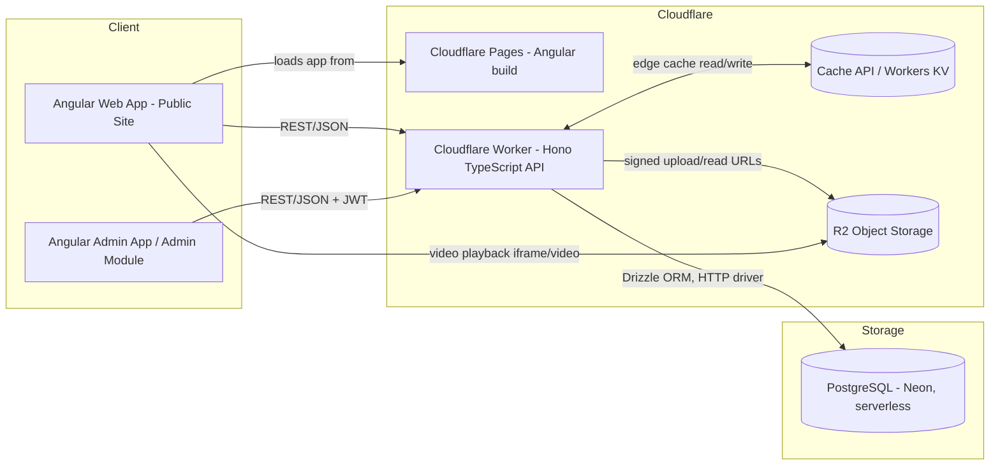
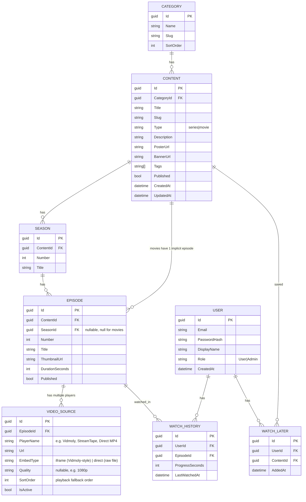

# AniSpeaker — Platform Rework Architecture

**Status:** Proposed
**Scope:** Backend migration (Cloudflare Worker + JSON DB → TypeScript/Hono API on Cloudflare Workers + PostgreSQL on Neon), Admin CMS, Guest-first auth with optional login, Watch Later / Continue Watching, multi-source video playback, edge caching.

**Confirmed stack:** Frontend Angular (hosted on Cloudflare Pages) · Backend TypeScript (Hono), deployed to **Cloudflare Workers** · Database PostgreSQL (Neon, serverless) · Object storage Cloudflare R2 · Caching via Cloudflare Cache API + Workers KV.

---

## 1. Current State (as-is)

| Layer | Current |
|---|---|
| Frontend | Angular SPA (Home, Cartoons, Anime, Movies, Search) |
| Backend | Cloudflare Worker |
| Database | JSON file(s) on Cloudflare (KV / static JSON) |
| Auth | None |
| Video hosting | Unknown / external links (assumed) |
| Admin | None — content is edited by hand in JSON |

**Why this breaks down as you grow:**
- JSON-as-DB has no relational integrity, no indexing, no concurrent-write safety, and every content edit means redeploying/rewriting a file.
- No admin UI means you're hand-editing JSON to add a show — error-prone and slow.
- No user layer means no Watch Later / Continue Watching, which you now want.
- The problem was never Cloudflare Workers themselves — it was pairing a Worker with a flat JSON file as the "database." A Worker talking to a real database (Neon/Postgres) through a proper ORM doesn't have this problem, which is why this plan keeps your API on Workers and fixes the storage layer instead.

---

## 2. Goals of the Rework

1. Replace JSON DB with a real relational database.
2. New backend: **TypeScript (Hono) API**, deployed to **Cloudflare Workers**, connected to **Neon Postgres** via Drizzle ORM.
3. **Admin panel** (separate route/app) with full CRUD: add/edit/delete Categories, Series, Seasons, Episodes/Movies, and **bulk video URL import**.
4. **No forced login** for viewers — browsing and watching work anonymously.
5. **Optional login** unlocks **Watch Later** and **Continue Watching / Recently Watched**.
6. Keep Angular frontend, but restructure it to be scalable (lazy-loaded feature modules, typed API layer, guest-identity handling).
7. Video playback handled via external player embeds (Vidmoly) and/or R2 object storage — the API itself never streams video bytes.
8. **Edge caching** (Cache API + Workers KV) to cut repeated Neon queries and speed up responses for catalog data that rarely changes.

---

## 3. High-Level Architecture



**Key decision: the Worker API never streams video bytes itself.** It only issues metadata, signed URLs (for R2 images), and video source lists (mostly Vidmoly embed links). Video is either embedded directly from Vidmoly or served from R2 via CDN — never proxied through the Worker. This keeps each Worker invocation fast and well within Cloudflare's per-request CPU time limits.

---

## 4. Tech Stack

| Concern | Choice | Why |
|---|---|---|
| Backend framework | Hono (TypeScript), running on Cloudflare Workers | Purpose-built for the Workers runtime — tiny, fast, Express-like routing, first-class TypeScript support |
| ORM / DB driver | Drizzle ORM + `@neondatabase/serverless` (Neon's HTTP driver) | Workers can't open a raw TCP socket the way a normal Node server can, so a standard `pg`/node-postgres client won't work here. Neon's driver talks to Postgres over HTTP/WebSocket instead — exactly what the Workers runtime supports. Drizzle has first-class support for this driver and gives typed queries + migrations without a heavy ORM runtime. |
| Database | PostgreSQL on **Neon** (serverless, free tier, scales to zero) | Unchanged — still the sole DB host, decoupled from wherever the API runs |
| Auth | JWT via `jose` (access + refresh token); passwords hashed with **PBKDF2** via the Web Crypto `SubtleCrypto` API | Both are Workers-native — no native Node bindings required (which rules out typical `bcrypt` packages on Workers). `jose` + Web Crypto are the standard choices in the Workers ecosystem for exactly this. |
| Video/image storage | Cloudflare R2 | Unchanged — zero egress fees, and now even more natural since R2 is a native Workers binding (no separate SDK/credentials needed inside the Worker) |
| Caching | Cloudflare Cache API (edge response caching) + Workers KV (structured cache) — see §7 | Cuts repeated Neon queries for catalog data that rarely changes, and shaves latency since cached responses are served from the edge location nearest the viewer |
| Hosting (API) | **Cloudflare Workers** (deployed via Wrangler CLI) | Replaces Render/Docker — no container to build or manage; deploy is `wrangler deploy` |
| Hosting (DB) | **Neon** exclusively | Unchanged |
| Frontend | Angular (existing), standalone components + lazy routes, hosted on **Cloudflare Pages** | Unchanged |
| Admin auth | Same JWT system, `Admin` role claim, checked via Hono middleware | One backend, role-gated routes |

> Current stack cost: Neon free tier + Cloudflare Workers (generous free tier) + Cloudflare R2 (10GB free, no egress fee) + Cloudflare Pages (free) is effectively a $0/month stack, and now everything except the database sits under one Cloudflare account/bill.

---

## 5. Database Schema



**Notes:**
- `Content.Type` distinguishes Series vs Movie so movies just get a single implicit Episode row (keeps playback logic uniform — every episode/movie is one `EPISODE` row).
- **`VIDEO_SOURCE` replaces the old single `VideoUrl` field.** Each episode can have multiple playable sources — different hosting providers/players (e.g. Vidmoly, StreamTape, a direct R2-hosted MP4), different qualities, or mirrors. `SortOrder` determines which plays first; the player falls back to the next active source if one fails to load. This is fully relational (not a JSON blob) so each source stays individually addable/editable/deletable from the admin panel, with its own `IsActive` toggle if a particular mirror goes down.
- **`EmbedType` tells the frontend how to render the source.** A Vidmoly (or StreamTape, etc.) URL is an **embed page**, not a playable file — it only works inside an `<iframe>`, using that provider's own player UI. A file you uploaded yourself to R2 is a **direct** file URL, playable natively in an HTML5 `<video>` tag. Set `EmbedType = 'iframe'` for Vidmoly/StreamTape/any third-party embed link, and `EmbedType = 'direct'` for anything you host yourself on R2.
- `WatchHistory` is upserted (unique index on `UserId + EpisodeId`) so "Continue Watching" is just: latest `LastWatchedAt`, `ProgressSeconds < DurationSeconds * 0.95`.
- Guests (not logged in) never write to `WatchHistory`/`WatchLater` server-side. Optionally cache their last few views in `localStorage` client-side so "Recently Watched" still shows *something* without an account (see §9).

**`VIDEO_SOURCE` migration SQL:**

```sql
ALTER TABLE "EPISODE" DROP COLUMN "VideoUrl";

CREATE TABLE "VIDEO_SOURCE" (
    "Id"         uuid PRIMARY KEY DEFAULT gen_random_uuid(),
    "EpisodeId"  uuid NOT NULL,
    "PlayerName" varchar(50) NOT NULL,
    "Url"        varchar(500) NOT NULL,
    "EmbedType"  varchar(20) NOT NULL DEFAULT 'iframe',
    "Quality"    varchar(20),
    "SortOrder"  integer NOT NULL DEFAULT 0,
    "IsActive"   boolean NOT NULL DEFAULT true,
    CONSTRAINT "CK_VideoSource_EmbedType" CHECK ("EmbedType" IN ('iframe', 'direct'))
);

ALTER TABLE "VIDEO_SOURCE"
ADD CONSTRAINT "FK_VideoSource_Episode"
FOREIGN KEY ("EpisodeId") REFERENCES "EPISODE" ("Id") ON DELETE CASCADE;

CREATE INDEX "IX_VideoSource_Episode_Sort" ON "VIDEO_SOURCE" ("EpisodeId", "SortOrder");
```

---

## 6. Backend (TypeScript / Cloudflare Workers) Architecture

A Hono project doesn't need .NET-style layering — keep it flat and pragmatic: routes call services, services call the Drizzle DB client directly. No Controllers/Application/Infrastructure split needed for a project this size.

```
anispeaker-api/
├── src/
│   ├── index.ts                  # Hono app — binds routes + middleware, exported fetch handler
│   ├── routes/
│   │   ├── content.ts             # public: GET /api/content, /api/content/:slug, /api/search
│   │   ├── playback.ts            # public: GET /api/playback/:episodeId
│   │   ├── auth.ts                 # POST /api/auth/register|login|refresh
│   │   ├── account.ts              # auth-required: watch-later, watch-history
│   │   └── admin/
│   │       ├── categories.ts
│   │       ├── content.ts
│   │       ├── episodes.ts         # includes bulk-urls import
│   │       └── uploads.ts          # R2 pre-signed URL (images)
│   ├── db/
│   │   ├── schema.ts               # Drizzle schema — mirrors §5 tables 1:1
│   │   └── client.ts               # Neon HTTP driver + Drizzle instance, built from env.DATABASE_URL
│   ├── middleware/
│   │   ├── auth.ts                 # verifies JWT (jose), attaches user to context
│   │   ├── adminOnly.ts            # checks role === 'Admin'
│   │   └── cache.ts                 # wraps a route with Cache API / KV read-through caching (§7)
│   └── lib/
│       ├── jwt.ts                   # sign/verify helpers (jose)
│       └── password.ts              # PBKDF2 hash/verify via Web Crypto
├── drizzle/                        # generated migration files (drizzle-kit)
├── wrangler.toml
├── package.json
└── tsconfig.json
```

### Video ingestion flow — bulk Vidmoly URL import (primary path)

Since video is hosted externally on **Vidmoly** rather than uploaded to R2, the admin flow isn't "upload a file" — it's "paste a batch of Vidmoly URLs, one becomes one episode, in the order pasted":

1. Admin opens a season (or a movie's content page) and clicks **"Bulk add from URLs."**
2. A textarea accepts one URL per line — admin pastes however many links they have (e.g. a whole season's worth of Vidmoly links at once, likely copied from output produced by the existing Vidmoly downloader tool).
3. Admin UI calls `POST /api/admin/seasons/{id}/episodes/bulk-urls` with `{ urls: string[], playerName: "Vidmoly" }`.
4. The route handler creates **one `EPISODE` row per URL, in list order** — `Number` is auto-assigned sequentially continuing from the season's current highest episode number (so pasting 12 URLs into an empty season creates Episodes 1–12, in that exact order), each paired with exactly **one `VIDEO_SOURCE` row** (`Url` = the pasted link, `PlayerName` = "Vidmoly", `EmbedType` = `'iframe'`, `SortOrder` = 0). Run this as a single Drizzle transaction so a failure partway through doesn't leave half-created episodes.
5. Titles default to `"Episode {Number}"` — admin can rename individual episodes afterward without affecting order or the stored URL.

For a **movie**, the equivalent is simpler — a single-URL field on the content form (`POST /api/admin/content/{id}/episode` with one `url`), since a movie only ever has one implicit episode.

**Why one URL = one episode, not one URL = one `VIDEO_SOURCE` row on a shared episode:** each Vidmoly link is a distinct piece of content (a distinct episode), not an alternate mirror of the same episode. The per-episode "multiple sources" model from §5 still exists for when you later want to add a *second* mirror/backup link to an episode that already has one — that stays a manual single-row add on that specific episode's Video Sources editor, separate from the bulk import.

R2 stays in the picture only for **poster/banner images** (the Admin Panel's image upload widget — §10 below) and as an optional `direct` source if you ever *do* self-host a specific file — but it's no longer the primary or expected path for video.

---

## 7. Caching Strategy

Every query from the Worker to Neon is a network hop (Neon's HTTP endpoint, not a local DB) — and catalog data (categories, content lists, content detail, search) changes rarely, since admin edits happen occasionally, not continuously. Caching at the edge cuts that round-trip for most requests and speeds up responses for viewers.

**Two layers, for different jobs:**

| Layer | What it's for | TTL | Notes |
|---|---|---|---|
| Cloudflare Cache API (`caches.default`) | Whole-response edge caching for public GET routes | 60s–5min | Built into Workers, zero extra cost/setup, cached at the edge location nearest the viewer |
| Workers KV | Structured key-based cache for specific expensive reads (e.g. a full content-detail payload with nested seasons/episodes) | Minutes to hours, explicitly invalidated on write | A good fit given you already have KV from the old setup — but now it's purely a cache, not the source of truth (Neon is) |

**What gets cached:**
- `GET /api/content` (browse/listing), `GET /api/content/:slug` (detail), `GET /api/search`, category listings — all public, identical for every viewer, safe to cache.
- `GET /api/playback/:episodeId` — also public/non-personalized (it just returns video source URLs for an episode), safe to cache.

**What never gets cached:**
- Anything under `/api/account/*` (watch-later, watch-history) — this is per-user, private data. A shared edge cache risks leaking one user's data to another if a cache key isn't perfectly scoped, so the simplest and safest rule is: **never cache authenticated/personalized responses, full stop.**
- `/api/auth/*` — login/register/refresh must always hit the backend fresh.
- Any `/api/admin/*` route — admin needs to see live data when managing content, not a stale cache.

**Invalidation:** simplest approach — **short TTL, no explicit purge.** A 60–120 second cache means an admin edit shows up for viewers within two minutes, which is completely fine for a catalog site (nobody needs a new episode to appear instantly). This avoids building cache-invalidation logic entirely for v1. If instant updates ever matter, the admin write routes can explicitly call `cache.delete()` / `KV.delete()` for the specific affected keys — an easy addition later, not needed to start.

**Example middleware (Hono + Cache API):**

```ts
// middleware/cache.ts
import type { Context, Next } from 'hono';

export const edgeCache = (ttlSeconds = 60) => {
  return async (c: Context, next: Next) => {
    const cache = caches.default;
    const cacheKey = new Request(c.req.url, c.req.raw);

    const cached = await cache.match(cacheKey);
    if (cached) return cached;

    await next();

    if (c.res.status === 200) {
      const response = c.res.clone();
      response.headers.set('Cache-Control', `public, max-age=${ttlSeconds}`);
      c.executionCtx.waitUntil(cache.put(cacheKey, response));
    }
  };
};
```

```ts
// routes/content.ts
contentRoutes.get('/api/content', edgeCache(120), async (c) => { /* ... */ });
```

GET requests check the edge cache first, only hitting Neon (via Drizzle) on a miss, then populate the cache for the next viewer — no code changes needed in the route handler itself beyond adding the middleware.

---

## 8. Video Storage & Streaming

**Primary approach: Vidmoly-hosted URLs, embedded via `iframe`.** Vidmoly already provides its own player, CDN delivery, and bandwidth — dropping a Vidmoly URL into an `<iframe src="...">` shows their native player as-is, with no transcoding, storage, or streaming infrastructure required on your end. This is why R2/Cloudflare Stream/Bunny Stream (below) are secondary, not the main plan:

| Option | Role in AniSpeaker | Notes |
|---|---|---|
| **Vidmoly (external, `iframe` embed)** | **Primary video source for nearly all content** | No hosting cost to you, no transcoding, player is built-in. Trade-off: no accurate per-second watch-progress tracking (rendering notes below), and you're dependent on Vidmoly staying up/accessible. |
| Cloudflare R2 (`direct` source) | Optional, secondary | Only used if/when you choose to self-host a specific file — e.g. an exclusive upload with no Vidmoly link, or a case where accurate watch-progress tracking matters enough to justify hosting it yourself. |
| Cloudflare Stream / Bunny Stream | Not currently planned | Left in as a future option only if you eventually move toward self-hosting at scale. |

**Multi-source playback:** since each episode can have several `VIDEO_SOURCE` rows (different players/hosts, per §5), the player page requests `GET /api/playback/{episodeId}`, gets back the active sources ordered by `SortOrder`, and loads the first one — for most episodes this will simply be the one Vidmoly link created during bulk import. If that source fails to load/play (dead link, blocked embed, etc.), the frontend automatically falls back to the next source in the list, if a second one was manually added.

**Rendering by `EmbedType`:** the player component branches on each source's `EmbedType` before deciding *how* to load it:
- `iframe` (Vidmoly, StreamTape, any third-party host — **the default and typical case**) → render `<iframe [src]="sanitizedUrl" allowfullscreen sandbox="allow-scripts allow-same-origin allow-presentation">`, using that provider's own player as-is. Angular requires the URL to be run through `DomSanitizer.bypassSecurityTrustResourceUrl()` before binding it to `[src]`, or it'll be stripped for safety.
- `direct` (your own R2-hosted files, when used) → render a normal `<video controls [src]="url">` (or a lightweight player library like Plyr/Video.js on top of it if you want custom controls, thumbnails-on-seek, etc.) — you have full control over this one since it's your own file, unlike an iframe embed.
- Your progress-tracking (`timeupdate` → `POST /api/account/history`) only works reliably on the **`direct`** case, since you own the `<video>` element and its events. An `<iframe>` embed's internal playback progress isn't accessible to your page (cross-origin), so for `iframe`/Vidmoly sources you can't report real-time watch progress — at best you can mark "watched" (or log a history row) the moment the user opens that episode, not track exact seconds. Since Vidmoly is your primary path, **Continue Watching will realistically work at "opened this episode" granularity, not "resumed at 14:32" granularity** — worth knowing going in, since it shapes what the Continue Watching UI can honestly promise. If precise resume-position tracking becomes a priority later, that's the point where self-hosting specific titles via R2 `direct` sources would start to make sense.

---

## 9. Auth Strategy — Guest-First

**Requirement:** browsing/watching works with zero login. Login is optional and only unlocks personalization.

| Feature | Guest (no login) | Logged-in |
|---|---|---|
| Browse, search, watch | ✅ | ✅ |
| Watch Later | ❌ (or client-side only, see below) | ✅ synced to account |
| Continue Watching / Recently Watched | Client-side only (localStorage, last ~10 items, per-device) | ✅ synced to account, cross-device |

**How it works technically:**
- No forced auth middleware on the `content`/`playback` routes — fully anonymous.
- The `account` routes (`/api/account/watch-later`, `/api/account/history`) sit behind an `authMiddleware` Hono middleware that verifies the JWT (via `jose`) and attaches the user to the request context — return `401` if missing/invalid, and the **frontend simply doesn't call them** when there's no logged-in user.
- Passwords are hashed with **PBKDF2 via the Web Crypto `SubtleCrypto` API** — natively available in the Workers runtime with no extra dependency (typical `bcrypt` packages rely on native Node bindings that Workers doesn't support).
- On the client: maintain a lightweight `AuthService` with `isLoggedIn$` observable. When false, "Recently Watched" reads from `localStorage` (updated on every `timeupdate` player event, throttled); when true, it reads from `/api/account/history` instead. Same pattern for Watch Later, except with no logged-in fallback (just show a "Log in to save for later" prompt — small friction is fine for a save action, but never for playback).
- JWT: short-lived access token (15 min) + refresh token (7–30 days, httpOnly cookie) so users stay logged in without re-entering credentials constantly.

---

## 10. Admin Panel Spec

A separate route tree in the same Angular app (e.g. `/admin/**`), guarded by a route guard checking `role === 'Admin'`, calling admin-only endpoints.

**Pages:**

1. **Dashboard** — counts (Series, Movies, Episodes, Users), recent uploads.
2. **Categories** — table with inline add/edit/delete, drag-to-reorder (`SortOrder`).
3. **Content list** (Series & Movies) — searchable/filterable table, "+ New" button, edit/delete row actions, publish/unpublish toggle.
4. **Content editor** (add/edit) — form: Title, Slug (auto-generated, editable), Category, Type, Description, Poster/Banner image upload, Tags, Published toggle.
   - If `Type = Series`: nested **Seasons → Episodes** editor (add season, add episode under season, reorder, each episode has its own thumbnail + duration + **a list of video sources**).
   - If `Type = Movie`: same episode editor fields directly on the content form (no seasons), including its own video sources list.
5. **Bulk URL import** (per season, or per movie) — the primary way episodes get added: a textarea for pasting multiple Vidmoly URLs (one per line), submitted together. Each line becomes one new `EPISODE`, numbered in paste order, each with one `VIDEO_SOURCE` row (`EmbedType = 'iframe'`). This is the fast path for populating a whole season in one action instead of creating episodes one at a time.
6. **Video sources editor** (per episode, for fine-tuning after bulk import) — a repeatable row list: Player Name, URL, **Embed Type (Iframe / Direct)**, Quality, Sort Order, Active toggle. Used to add a second mirror/backup link to an episode that already has one from bulk import, reorder which plays first, or deactivate a dead link without deleting its row. Embed Type defaults to `iframe` since Vidmoly/StreamTape links are embed pages — admin only switches it to `direct` when pasting a raw R2 file URL.
7. **Image upload widget** (poster/banner, shared component) — drag/drop or file picker → calls `init upload` → direct PUT to R2 with progress bar → on success, stores the returned URL into the content form. (Video no longer goes through this widget — see §6's bulk URL import instead.)
8. **Users** (optional, phase 2) — list registered users, promote/demote Admin role.

**Core admin endpoints:**

```
GET    /api/admin/categories
POST   /api/admin/categories
PUT    /api/admin/categories/{id}
DELETE /api/admin/categories/{id}

GET    /api/admin/content?search=&category=&type=&page=
POST   /api/admin/content
PUT    /api/admin/content/{id}
DELETE /api/admin/content/{id}

POST   /api/admin/content/{id}/seasons
POST   /api/admin/seasons/{id}/episodes                    # single manual episode (rare — bulk-urls is the normal path)
POST   /api/admin/seasons/{id}/episodes/bulk-urls           { urls: string[], playerName? }   # primary path: 1 URL → 1 new episode, in order
POST   /api/admin/content/{id}/episode                      { url, playerName? }               # movie equivalent — single implicit episode
PUT    /api/admin/episodes/{id}
DELETE /api/admin/episodes/{id}

GET    /api/admin/episodes/{id}/sources
POST   /api/admin/episodes/{id}/sources                     { url, playerName, embedType, quality? }   # add a 2nd mirror to an existing episode
PUT    /api/admin/sources/{id}
DELETE /api/admin/sources/{id}
PUT    /api/admin/episodes/{id}/sources/reorder     { orderedSourceIds: [...] }

POST   /api/admin/uploads/init      { fileName, contentType, folder }  → { uploadUrl, publicUrl, objectKey }   # images only (poster/banner)
```

**Public endpoints:**

```
GET  /api/content?category=&type=&page=          # browse
GET  /api/content/{slug}                          # detail + seasons/episodes
GET  /api/search?q=                                # typeahead + full results
GET  /api/playback/{episodeId}                     # returns ordered list of active video sources for this episode
POST /api/auth/register
POST /api/auth/login
POST /api/auth/refresh
GET  /api/account/history        (auth)
POST /api/account/history        (auth)  # upsert progress
GET  /api/account/watch-later    (auth)
POST /api/account/watch-later    (auth)
DELETE /api/account/watch-later/{contentId} (auth)
```

---

## 11. Frontend (Angular) Architecture

Restructure into feature-based, lazy-loaded modules (or standalone components with lazy routes if on Angular 17+):

```
src/app/
├── core/                     # singletons: interceptors, auth service, api base config
│   ├── interceptors/         # attach JWT, handle 401 refresh
│   └── services/
│       ├── auth.service.ts
│       ├── api.service.ts    # thin typed HTTP wrapper
│       └── local-history.service.ts   # guest-mode "recently watched" in localStorage
├── shared/                   # dumb/presentational components: card, carousel, button, modal
├── features/
│   ├── home/
│   ├── browse/                # category pages (Cartoons/Anime/Movies)
│   ├── search/
│   ├── content-detail/
│   ├── player/                 # video player page, reports progress
│   ├── watch-later/            (auth-gated)
│   ├── auth/                   # login/register (optional, non-blocking)
│   └── admin/                  # lazy-loaded, role-guarded
│       ├── dashboard/
│       ├── categories/
│       ├── content-list/
│       ├── content-editor/
│       └── uploads/
├── models/                   # DTO interfaces matching API contracts
└── app.routes.ts
```

**Key patterns:**
- Route-level lazy loading for `/admin` so its bundle never ships to normal viewers.
- `AuthInterceptor` attaches JWT if present; silently does nothing for guests (no forced redirect to login anywhere in the public site).
- `authGuard` only applied to `/admin/**` and `/watch-later`.
- Player component: renders `<iframe>` or `<video>` per source's `EmbedType` (see §8). On `timeupdate` (throttled ~5s, `direct` sources only), if logged in → `POST /api/account/history`; if guest → write to `local-history.service` (localStorage, capped at ~10 entries, most-recent-first). For `iframe` sources, log a "started watching" history entry on load instead, since per-second progress isn't available cross-origin.

---

## 12. Cloudflare Workers Deployment

**`wrangler.toml` (example):**

```toml
name = "anispeaker-api"
main = "src/index.ts"
compatibility_date = "2026-09-01"
compatibility_flags = ["nodejs_compat"]

[[kv_namespaces]]
binding = "CACHE_KV"
id = "<your-kv-namespace-id>"

[[r2_buckets]]
binding = "MEDIA_BUCKET"
bucket_name = "anispeaker-media"

[vars]
# non-secret config only — secrets go via `wrangler secret put`, never here
```

**Secrets** (set via CLI, never committed to the repo):

```
wrangler secret put DATABASE_URL     # Neon pooled connection string, read by @neondatabase/serverless
wrangler secret put JWT_SECRET
```

**Deploy:**

```
wrangler deploy
```

Wrangler bundles the TypeScript directly — no separate build/Docker step needed.

**Custom domain:** attach something like `api.anispeaker.<yourdomain>` to the Worker via Cloudflare dashboard → Workers → Triggers → Custom Domain, so the Angular app's `environment.prod.ts` `apiBaseUrl` points at a stable URL instead of the default `*.workers.dev` subdomain.

**Frontend:** unchanged — still deployed on Cloudflare Pages; just point `apiBaseUrl` at the Worker's URL.

**Migrations against Neon:** run `drizzle-kit push` (or `generate` + apply) from your local machine. Workers don't have a persistent filesystem or shell to run migration commands from inside the deployed Worker itself, so this step always happens locally (or in a CI step), the same way `dotnet ef database update` would have — just the Drizzle equivalent.

---

## 13. Migration Plan (JSON → Postgres)

1. Stand up the new Postgres schema via Drizzle Kit migrations.
2. Write a one-time Node/TypeScript script (run locally with `tsx` or similar) that reads the existing JSON DB, maps each entry to `Category` → `Content` → `Season`/`Episode`, and bulk-inserts via the Drizzle client.
3. Re-upload existing video/image assets into R2 (or keep existing URLs if they're already on a stable CDN — `PosterUrl`, `BannerUrl`, and each `VIDEO_SOURCE.Url` are just strings, no need to force a re-host if the current links work; import each old episode's link as its first `VIDEO_SOURCE` row).
4. Point the new Angular build at the new Worker API, verify catalog parity against the old site, then cut over DNS/deploy.
5. Keep the old Cloudflare Worker + JSON DB read-only as a fallback for a week or two before decommissioning.

---

## 14. Suggested Build Order

1. Hono + TypeScript project skeleton on Cloudflare Workers; Drizzle schema + migrations against Neon for Category/Content/Season/Episode/VideoSource.
2. Public read routes (`/api/content`, `/api/search`, `/api/playback`) → wire Angular's existing pages to it, replacing the JSON fetch. Add the edge-cache middleware here early since it's a one-line wrap per route.
3. R2 binding + pre-signed image-upload route.
4. Admin panel: Categories CRUD → Content CRUD → Season/Episode CRUD → bulk Vidmoly URL import.
5. Auth (register/login/JWT via `jose`, PBKDF2 password hashing) + Watch Later + Watch History routes.
6. Frontend: guest-mode local history, login-gated Watch Later page, player progress reporting.
7. Deploy to Cloudflare Workers via Wrangler, run migration script against Neon from old JSON data.
8. Cut over.

---

## 15. Open Decisions (flag before building)

- **Backend runtime:** settled — **TypeScript (Hono) on Cloudflare Workers**, not .NET/Render. Database stays Neon either way, decoupled from the API host.
- **DB driver:** settled — Drizzle ORM + Neon's HTTP driver (`@neondatabase/serverless`), required because Workers can't hold a raw TCP connection the way `pg`/node-postgres expects.
- **Caching:** short-TTL (60–120s) edge cache by default, no explicit invalidation for v1 — revisit only if staleness actually becomes a complaint.
- **HLS now or later:** starting with plain `iframe`/MP4 is simpler; only worth revisiting if buffering becomes a real user complaint on self-hosted `direct` sources.
- **Email verification** on register — skip for v1 given login is optional/low-stakes, revisit if abuse becomes an issue.
- **Video source management:** each episode/movie supports multiple `VIDEO_SOURCE` rows instead of one `VideoUrl` — admin adds/reorders/deactivates sources per episode; player auto-falls-back on load failure.
